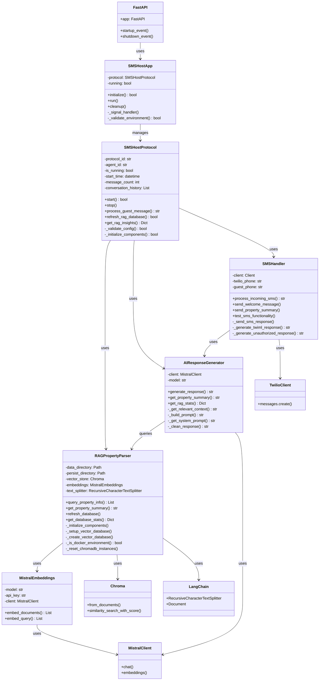

# 🏗️ SMS Host Protocol - Project UML Architecture

## 📊 Class Diagram



## 🏛️ Architecture Overview

### **📱 Application Layers:**

#### **1. Presentation Layer (FastAPI)**
- **FastAPI App**: Main web application with REST endpoints
- **SMSHostApp**: Application lifecycle management

#### **2. Controller Layer**
- **SMSHostProtocol**: Main orchestrator and business logic
- **AIResponseGenerator**: AI-powered response generation
- **SMSHandler**: SMS messaging and Twilio integration

#### **3. Configuration Layer**
- **RAGPropertyParser**: RAG architecture and vector database
- **MistralEmbeddings**: Custom embeddings for LangChain

### **🔗 Key Dependencies:**

#### **Core Dependencies:**
- **SMSHostProtocol** → **RAGPropertyParser** (RAG queries)
- **SMSHostProtocol** → **AIResponseGenerator** (AI responses)
- **SMSHostProtocol** → **SMSHandler** (SMS operations)

#### **AI Chain:**
- **AIResponseGenerator** → **RAGPropertyParser** (context retrieval)
- **AIResponseGenerator** → **MistralClient** (LLM generation)

#### **Data Flow:**
- **RAGPropertyParser** → **MistralEmbeddings** → **MistralClient**
- **RAGPropertyParser** → **Chroma** → **LangChain**

### **🚀 Design Patterns:**

#### **1. Orchestrator Pattern**
- **SMSHostProtocol** coordinates all components

#### **2. Strategy Pattern**
- **MistralEmbeddings** provides embedding strategy
- **RAGPropertyParser** provides retrieval strategy

#### **3. Factory Pattern**
- **Chroma.from_documents()** creates vector stores

#### **4. Observer Pattern**
- **SMSHostApp** observes protocol state changes

### **📊 Data Flow:**

```
Guest SMS → SMSHandler → AIResponseGenerator → RAGPropertyParser
    ↓
RAGPropertyParser → MistralEmbeddings → MistralClient
    ↓
AIResponseGenerator → MistralClient → Response
    ↓
SMSHandler → TwilioClient → Guest SMS
```

### **🔧 Key Features:**

- **Modular Architecture**: Clear separation of concerns
- **Dependency Injection**: Components are loosely coupled
- **Error Handling**: Graceful fallbacks and error recovery
- **Configuration Management**: Environment-based configuration
- **Docker Support**: Environment-aware database strategies

This architecture provides a robust, scalable foundation for the SMS Host Protocol system! 🎯
